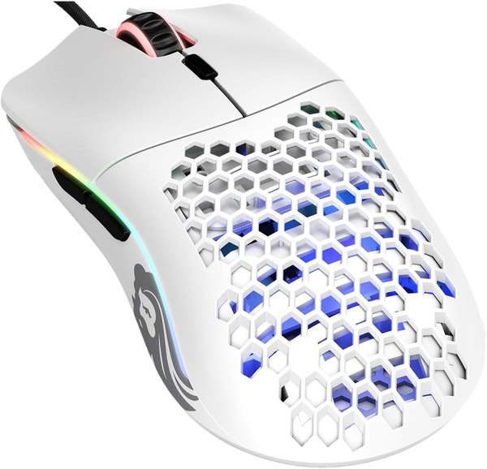

# SignalRGB plugin: Glorious Model O (wired)

  
   
  The original wired Glorious Model O (white).

Lets [SignalRGB](https://signalrgb.com) set the lighting of the original wired **Glorious Model O /
O-** mouse (USB `258A:0036`, a SinoWealth chip). SignalRGB only supports the Model O *Wireless*
out of the box.

## What it can do

The Model O has no live lighting mode: every color change is saved to the mouse's memory. So
instead of streaming colors like a keyboard, this plugin:

- sets the mouse to your effect's color when it changes, at most once every 10 seconds (you can
  lower this to 3), and skips changes too small to notice, so solid colors match right away and
  animated effects update now and then without wearing out the mouse's memory;
- or switches the mouse to one of its own built-in animations (Rainbow, Wave, Spectrum Cycle),
  which run smoothly on the mouse itself.

The whole mouse is one color. When SignalRGB closes, the mouse keeps its last color.

## Install

1. Quit Glorious Core if it's running.
2. In SignalRGB, open **Addons** and add this repo's GitHub URL.
3. Quit SignalRGB from the tray icon and open it again. **Glorious Model O** shows up under Devices.

## Settings

| Setting | What it does |
|---|---|
| Mouse Lighting | `Follow SignalRGB`, or one of the mouse's built-in animations, or `Off` |
| Seconds Between Color Updates | Minimum time between saved color changes (3-60, default 10) |
| Lighting Mode | `Canvas` follows the active effect, `Forced` uses one color |
| Forced Color | Color for `Forced` mode |

## Protocol

From [OpenRGB](https://gitlab.com/CalcProgrammer1/OpenRGB)'s `SinowealthController`, checked on a
real mouse. Interface 1 has two vendor collections (usage page `0xFF00`):

- command report `0x05`, 6 bytes: `05 11 00 00 00 00` asks for the configuration;
- configuration report `0x04`, 520 bytes (feature): read it, change the lighting bytes, set
  `[0x03] = 0x7B` and `[0x06] = 0x00`, and send it back.

| Offset | Meaning |
|---|---|
| `0x35` | mode: `00` off, `01` rainbow, `02` static, `05` spectrum cycle, `09` wave |
| `0x38` | static brightness (high nibble) |
| `0x39-0x3B` | static color, in the order **R, B, G** |

The plugin finds which SignalRGB collection number is which by trying pairs until one returns the
configuration.

`tools/test_plugin.mjs` runs the plugin against a fake mouse (`node tools/test_plugin.mjs`).
`tools/hid_list.py` lists the mouse's HID collections and report sizes (`pip install hidapi`).

## License

[GPL-3.0](LICENSE). The protocol comes from OpenRGB (GPL-2.0-or-later).
